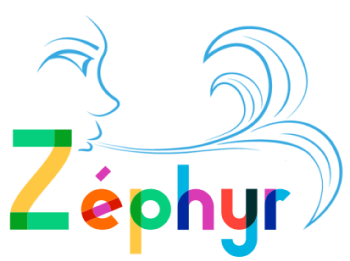
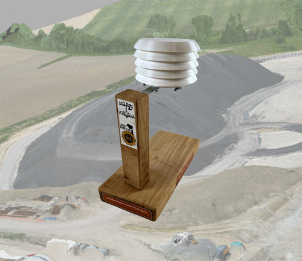

## Network of sensors monitoring air quality parameters.  

*The Zéphyr sensor on its demonstration support and in the background of the image the pile of gravel from the Puylaurens power plant.*

The Zéphyr sensor is an instrument that measures up to 9 physical air quality parameters:

* Particles from 1 to 10µm: PM1, PM2.5, PM4 and PM10 
* Volatile Organic Compounds VOCs
* Nitrogen Oxides Nox
* Air humidity
* Ambient temperature
* CO2 content (optional)  

It was developed during the fight against the A69 motorway project (Tarn/Haute-Garonne, Occitanie region in France) to oppose the establishment of two bitumen power plants whose authorities government authorities did not fully appreciate public health and environmental issues.

The operation was carried out at the initiative of the Lauragais Sans Bitume [LSB](https://www.lauragais-sansbitume.fr/) collective, supported by 11 other local bitumen-free collectives.

The sensors and the computer architecture to manage the data were designed by a group of enlightened amateurs from the territory impacted by the power plants, supported by the Granas de Carderas association which distributes the sensors from its [HelloAsso](https://www.helloasso.com/associations/granas-de-carderas) sales website.

The sensors deployed (more than 60 to date) send their data every 5 minutes to a server which allows the owners of the sensors to access a dashboard and everyone to view the mapping of the quality of air in real time.

[For more information see our GitBook site:](https://rhizobiome.gitbook.io/atrosca-degaze)

## *Credits*

We would like to thank the people who participated, on a voluntary basis, in this initiative.
The people involved were able to provide their skills in various areas to make this project a reality:

* Design & technical design of circuits to operate sensors
* 3D printing and assembly of the boxes in which the sensors are embedded
* Provision of a server and hosting
* Integration of applications (open source) used to collect data
* Development of the dasboards presented here
* Coordination of the project and all the skills necessary to achieve this result

All this without forgetting the contributors who took the step of acquiring a Zéphyr sensor and making the measurements taken by them available.
THANKS !!
